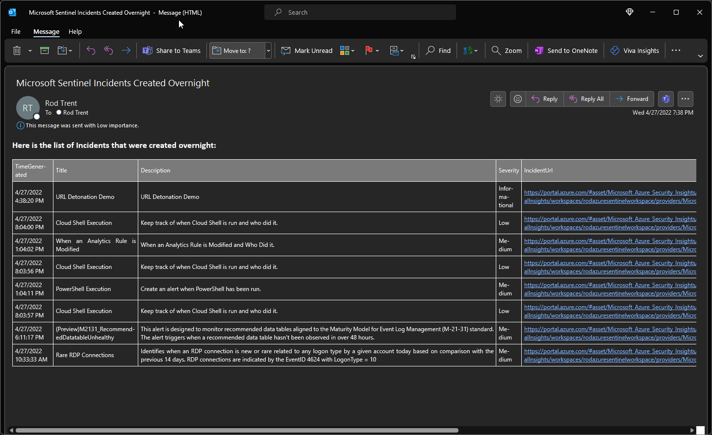

# ScheduledIncidentEmail

This Logic App queries the Log Analytics workspace for Microsoft Sentinel and then generates an email that delivers every morning at 7am. The email contains TimeGenerated, Title, Description, Severity, IncidentUrl.

The email looks like the following...

See <a href="https://rodtrent.substack.com/p/receive-an-email-notification-each">Receive an Email Notification Each Morning with the List of Daily Microsoft Sentinel Incidents Created</a> for more information.

